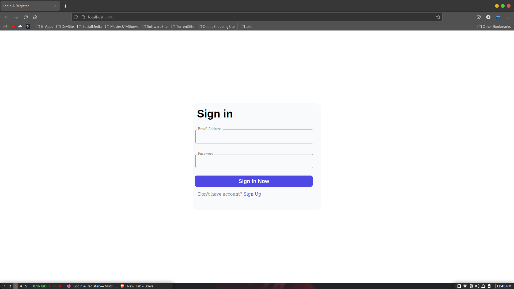
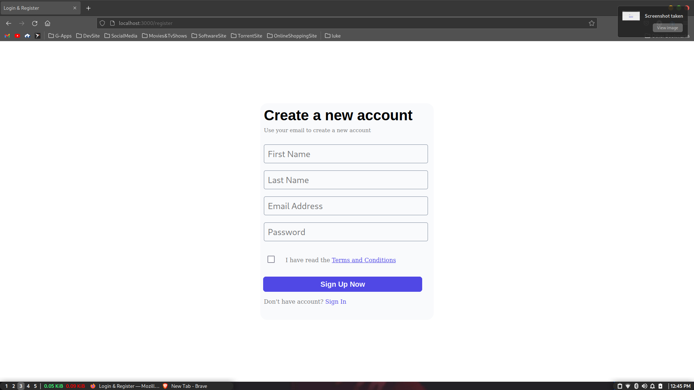
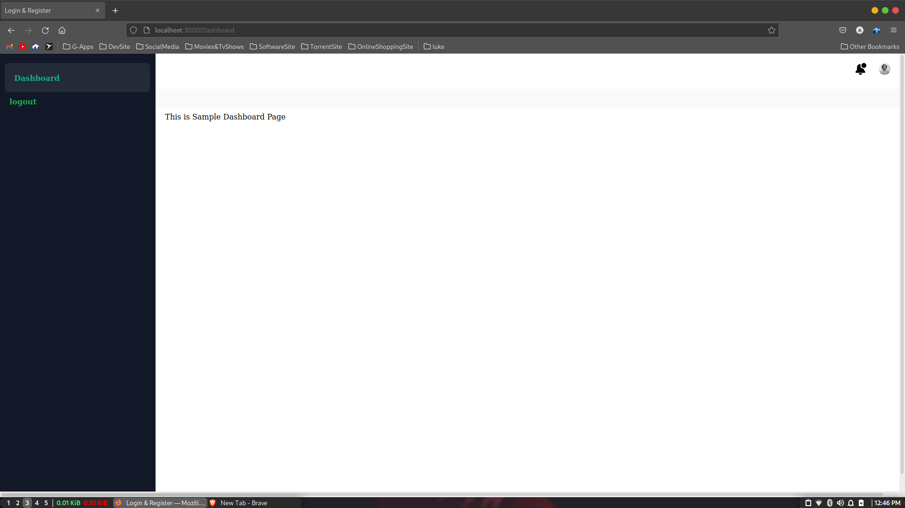
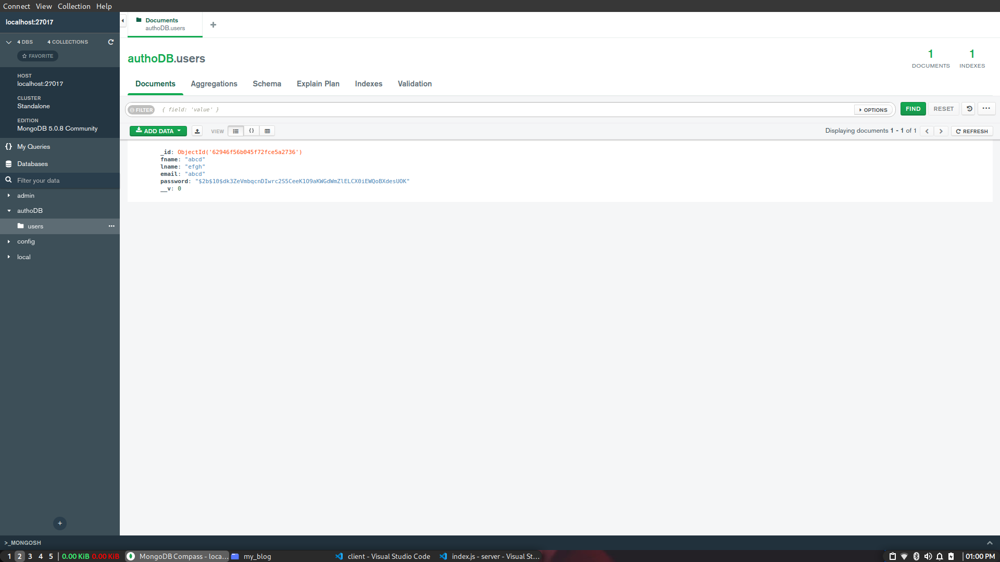

# loginNregister


# For client

- installed node packages:
  
  ```
  npm i express cors mongoose axios react-router-dom
  ```
  
  
 # For server
 -  installed node package:
    ```
    npm i bcrypt
    ```
    
 nodejs -v : v16.15.0
 
 npx -v : 8.11.0

 npm version : 
 ```
     {
      npm: '8.11.0',
      node: '16.15.0',
      v8: '9.4.146.24-node.20',
      uv: '1.43.0',
      zlib: '1.2.11',
      brotli: '1.0.9',
      ares: '1.18.1',
      modules: '93',
      nghttp2: '1.47.0',
      napi: '8',
      llhttp: '6.0.4',
      openssl: '1.1.1n+quic',
      cldr: '40.0',
      icu: '70.1',
      tz: '2021a3',
      unicode: '14.0',
      ngtcp2: '0.1.0-DEV',
      nghttp3: '0.1.0-DEV'
    }
  ```
  ## Login
  <br>
  ## Register
  <br>
  ## Dashboard
  <br>
  ## Database
  <br>
  
